# Aplikacja do inwentaryzacji

Projekt w ramach zajęć z inżynierii oprogramwoania

## Galeria zrzutów

  
Pokaż całość

  
  

    <a href="zrzuty/przykładowy-raport.pdf">Przykładowy raport w formie pdf</a>
  

  

    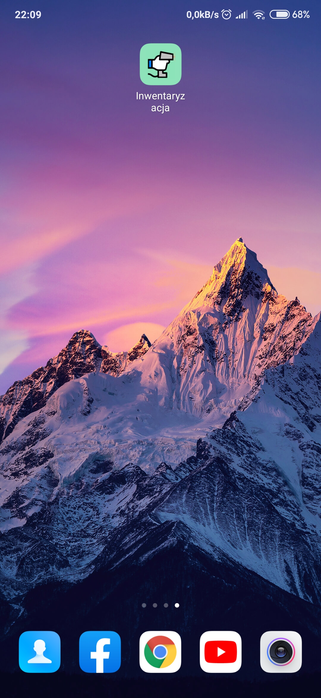
    
    
    
    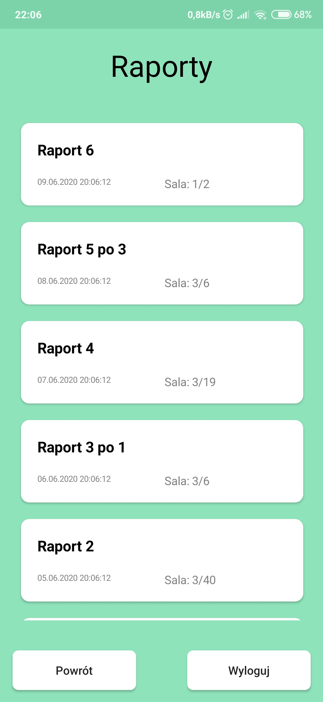
    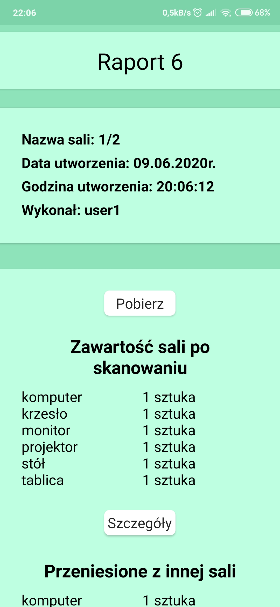
    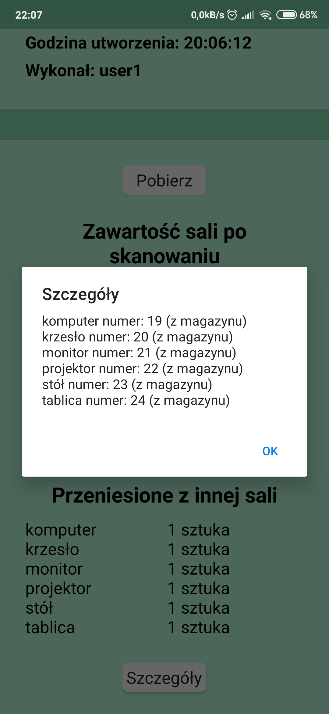
    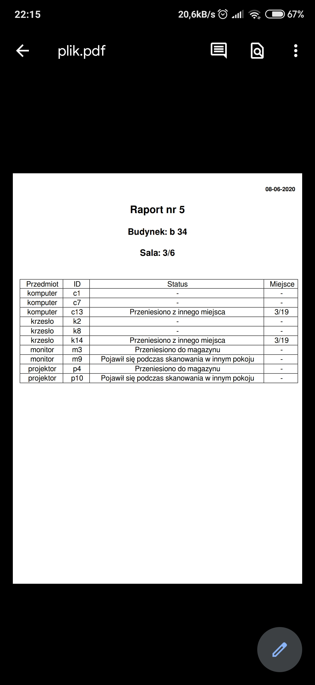
    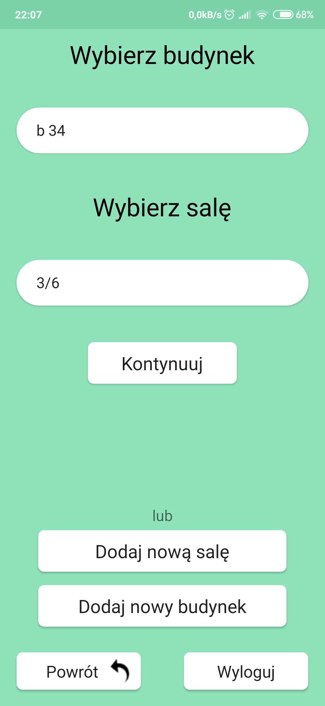
    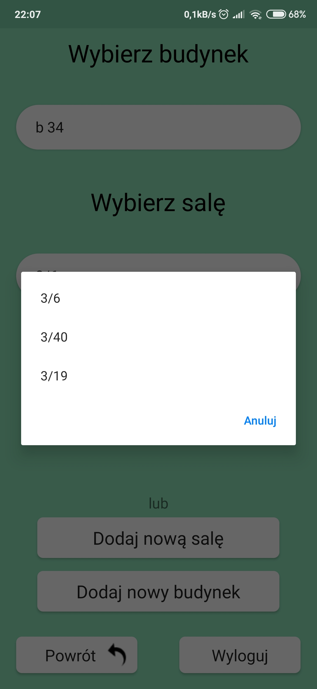
    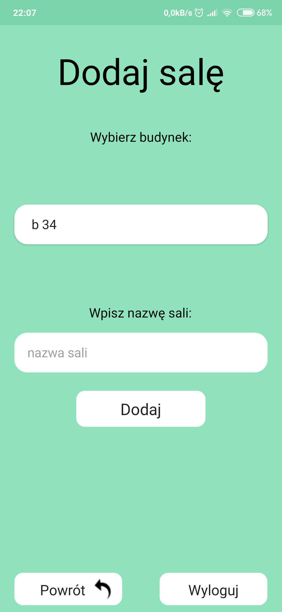
    
    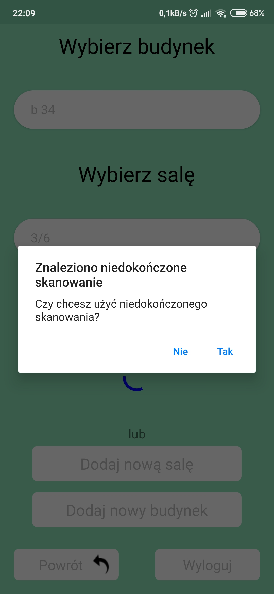
    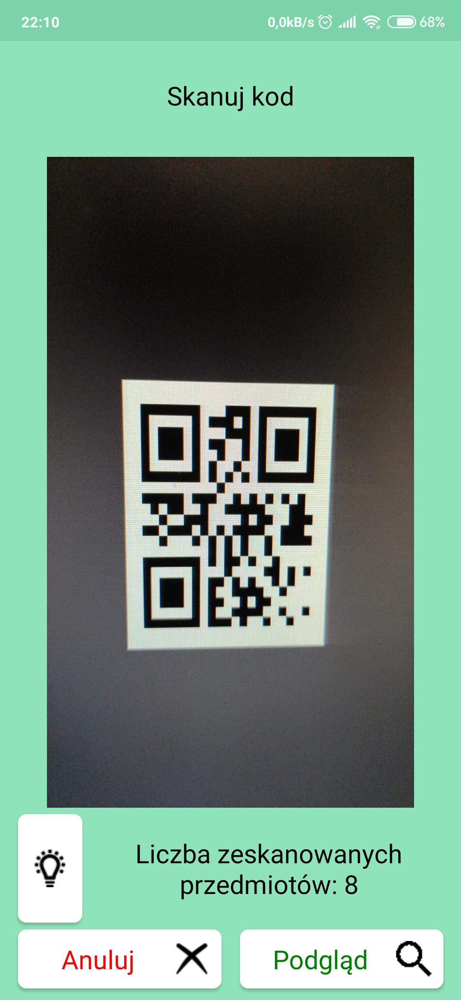
    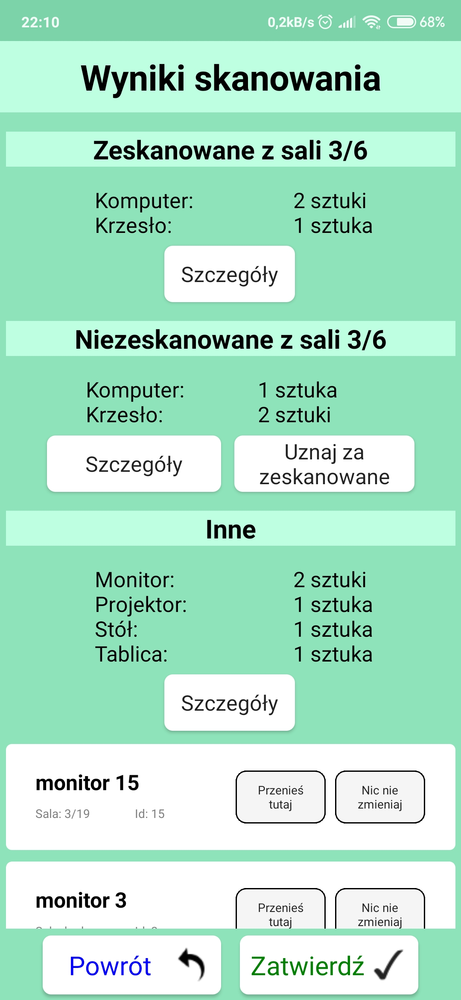
    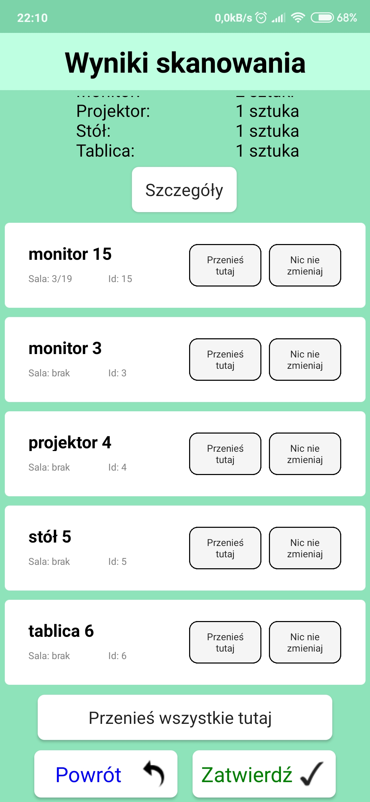
  

## Dokumentacja
- [Dokumentacja api by doxygen](http://aplikacja-do-inwentaryzacji.000webhostapp.com/dokumentacja/api/)
- [Dokumentacja samej aplikacji by doxygen](http://aplikacja-do-inwentaryzacji.000webhostapp.com/dokumentacja/aplikacja/)

## Ważne pliki
- [Przykładowe kody QR](QRCodes/)
- [Specyfikacja](Specyfikacja.pdf)
- [Instrukcja Obsługi](InstrukcjaObsługi.pdf)
- [Schematy](Schematy.pdf)

## Api
- [API, obsługujące procedury z bazy danych](https://github.com/Jerry-BloodBerry/InwentaryzacjaAPI)

# Schemat bazy danych

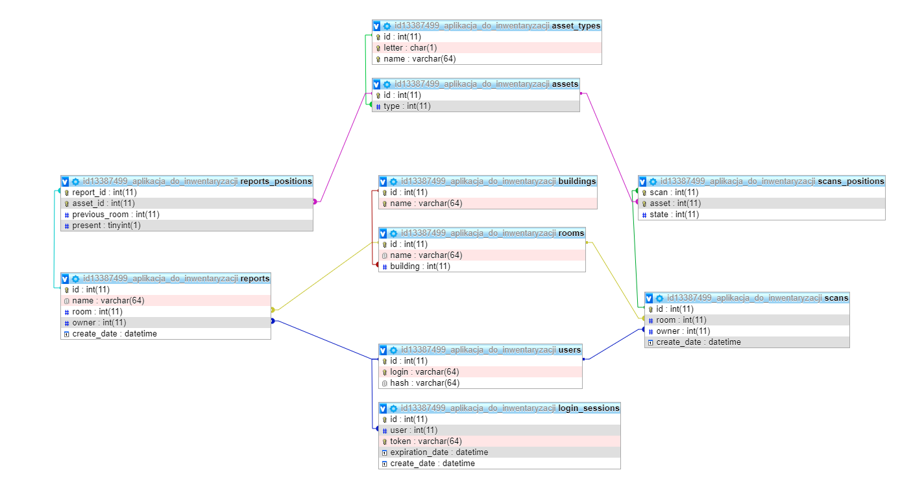

# Diagram klas UML

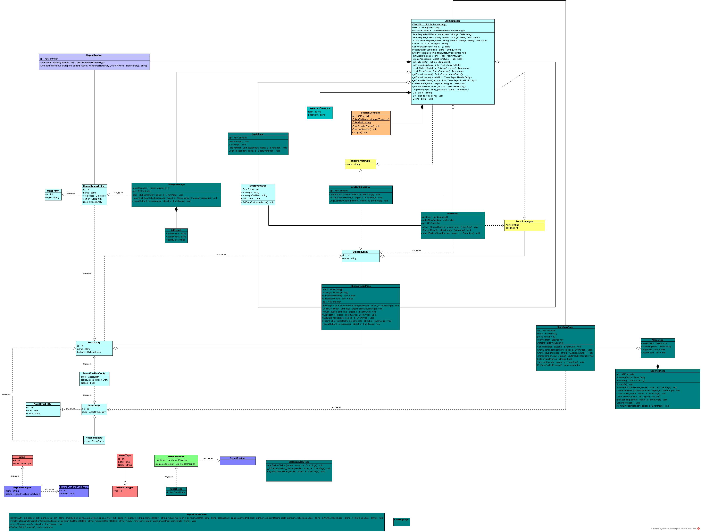

# Diagram przypadków użycia UML

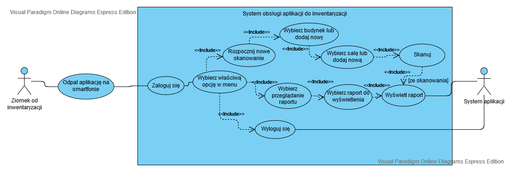

# Diagram czynności UML

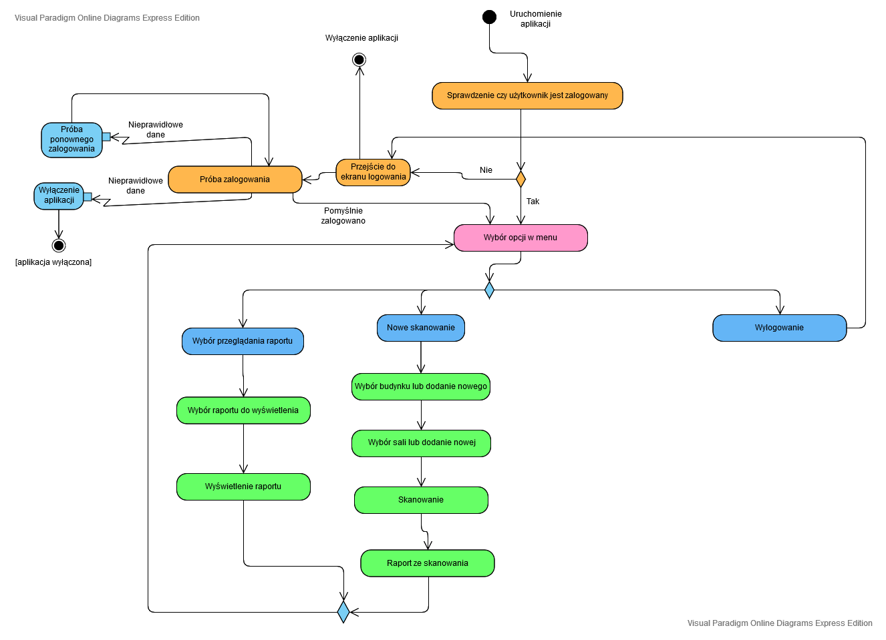
