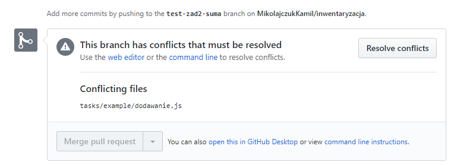
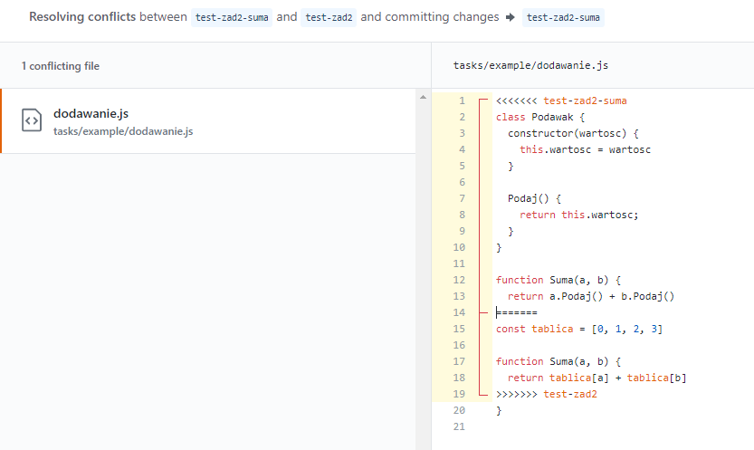
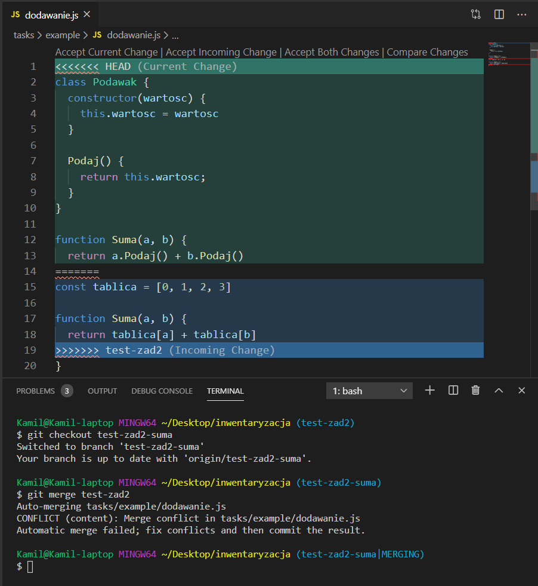

# Zadania treningowe

## Dla wszystkich zespołów - git

### Zadanie 1 Hello git

- Pobierz na swój komputer repozytorium
- Przełącz się na brancha training
- Stwórz swojego brancha np imie-nazwisko-training
- W katalogu /tasks/ stwórz katalog imie-nazwisko
- Tam umieszczaj swoje zadania
- Jeżeli nie zrobiłeś/aś jeszcze nic w ramach Xamarina/testów stwórz tam plik.txt z jakimś lorem ipsum
- Wyślij brancha na serwer
- Z poziomu githuba wykonaj pulla do brancha training

### Zadanie 2 Konflikty

- Zrób zadanie 1 jeżeli jeszcze go nie zrobiłeś, jak nie zaakceptowałem pulla z twoim zadaniem napisz na slacku do liderów z prośbą o akceptację zadania 1 (pull request musi być zweryfikowany i być mergowany)
- Pamiętaj aby każde zapisanie - commit odpowiednio nazwać np Edit dodawanie function
- Dobrą zasadą jest aby każdy pracował nad inną częścią systemu ale czasami nieuchronnie zdarzy sie że 2 osoby (lub niestety czasami więcej) muszą edytować tą samą funkcję i nie zawsze zrobią to bezkonfliktowo
- Zadanie to jest symulacją sytuacji jak 2 osoby zmienią tą samą funkcję na 2 inne sposoby i jak sobie z takimi sprawami radzić
- Przełącz się na brancha training
- Zaktualizuj lokalne repozytorium z serwerem aby mieć swoją pracę na tym branchu
- Stwórz brancha imie-nazwisko-zadanie2 (ważne aby inne niż poprzednio)
- W swoim katalogu (utworzonym w zadaniu 1) zrób plik z kodem swojego ulubionego języka np dodawanie.js
- Umieć w tym pliku funkcję dodającą 2 liczby (double) np

<code>

    // JS

    function Suma(a, b) {
      return a + b
    }

</code>

- Wykonaj commita, zapisując zmiany, wyślij je na serwer
- Zrób nowego brancha imie-nazwisko-nowa-suma
- Na tym branchu w pliku z sumą zamień a i b jako liczby na a i b jako podawaki (taki skaner)
- W razie potrzeby stwórz odpowiednią klasę Podawak lub skorzystaj z jakiejś wbudowanej np

<code>

    // JS

    class Podawak {
      constructor(wartosc) {
        this.wartosc = wartosc
      }

      Podaj() {
        return this.wartosc;
      }
    }

    function Suma(a, b) {
      return a.Podaj() + b.Podaj()
    }

</code>

- Wykonaj commita, zapisując zmiany, wyslij je na serwer
- Przełącz się na brancha imie-nazwisko-zadanie2, tego z początku zadania
- Teraz powinieneś mieć tą starą treść zadania
- Tym razem zamień a i b na liczby które znajdują się w jakiejś tablicy pod indeksem a i b, nie martwimy się o indeksy to nie jest w tym zadaniu istotne np

<code>

    // JS

    const tablica = [0, 1, 2, 3]

    function Suma(a, b) {
      return tablica[a] + tablica[b]
    }

</code>

- Zauważmy że liczenie sumy zmieniło się zupełnie inaczej niż w wersji z podawakiem, są to fragmenty niekompatybilne ze sobą
- Zapisujemy zmiany i wysyłamy na serwer
- Tu mamy 2 opcje możemy zrobić to lokalnie lub przez interfejs webowy gita, dopuszczam obie opcje
- Wykonujemy merge brancha imie-nazwisko-nowa-suma do brancha imie-nazwisko-zadanie2
- Musimy dostać wtedy informację o konflikcie w lini z obliczeniem sumy

Dla wersji przez interfejs webowy githuba

Dla wersji konsolowej

- Jeżeli takiego konfliktu nie ma znaczy to że coś zrobiliśmy źle, można spróbować to poprawić lub zacząć od nowa
- Rozwiązujemy ten konflikt powiedzmy łącząc te rozwiązania czyli mamy zrobić sumę elementów tablicy znajdującymi się pod indeksami które dostaniemy od podawaka
- Nie robimy tego od nowa tylko przerabiamy to co dostaniemy po próbie merga np

<code>

    // JS

    class Podawak {
      constructor(wartosc) {
        this.wartosc = wartosc
      }

      Podaj() {
        return this.wartosc;
      }
    }

    const tablica = [0, 1, 2, 3]

    function Suma(a, b) {
      return tablica[a.Podaj()] + tablica[b.Podaj()]
    }
  
</code>

- Zapisujemy oraz ponownie robimy merge brancha imie-nazwisko-nowa-suma do imie-nazwisko-zadanie2
- Jeśli robiliśmy lokalnie wysyłamy na serwer
- Z poziomu githuba wykonaj pulla do brancha training

## Do członków zespołu programistów

### Kalkulator

- Przełącz się na brancha training
- Stwórz swojego brancha np imie-nazwisko-kalkulator
- W katalogu tasks utwórz katalog imie-nazwisko
- W katalogu imie-nazwisko utwórz katalog kalkulator
- Utwórz w katalogu kalkulator nowy projekt Xamarin.Forms
- Twoim zadaniem będzie zbudowanie prostej aplikacji kalkulatora
- Kalkulator ma pobierać dwie liczby (skorzystaj z taga Editor)
- Pod kalkulatorem ma się znajdować przycisk oblicz
- Po kliknięciu przycisku pod kalkulatorem powinny się pojawiać wyniki 4 działań arytmetycznych(dodawanie, odejmowanie, mnożenie, dzielenie)
- (Opcjonalnie) Dodaj na górze ładne tło z obrazkiem kalkulatora
- Całość powinna wyglądać mniej więcej tak: https://imgur.com/a/kAN5dY2

## Do członków zespołu dokumentacji

### Pisanie komentarzy XML

1. Przełącz się na brancha `training`.
2. Stwórz swojego brancha `imie-nazwisko-trening-dokumentacja`.
3. W katalogu tasks utwórz katalog `imie-nazwisko`.
4. Skopiuj plik `Program.cs` z `training/tasks/zadanie-docs/` do swojego katalogu.
5. Napisz dokumentację XML dla metod klasy MoreMath. W klasie Program metody są już udokumentowane, możesz się na nich wzorować.
Użyj następujących znaczników:
	* `
` - Opis działania funkcji
	* `<param name="">` - Opis parametru
	* `<returns>` - Opis zwracanej wartości  
Funkcje `Factorial` (silnia) i `Fibonacci` powinny być znane, natomiast `Lerp` to funkcja [interpolacji liniowej](https://pl.wikipedia.org/wiki/Interpolacja_liniowa).
Nie edytuj kodu. Napisz tylko komentarze dokumentacji nad metodami.
6. Wyślij brancha na serwer.
7. Z poziomu GitHuba wykonaj pulla do brancha training.

Wszelkie pytania proszę zadawać na Slacku na kanale `#zespół-dokumentacja`.

### Doxygen
1. Zainstaluj [Doxygen](http://www.doxygen.nl/download.html).
2. Na podstawie [tego filmu](https://youtu.be/-V_vHZPOZfY) wygeneruj dokumentację HTML dla kodu z poprzedniego zadania.
3. Umieść zrzut ekranu z dokumentacji klasy `MoreMath` na kanał `#zespół-dokumentacja`.